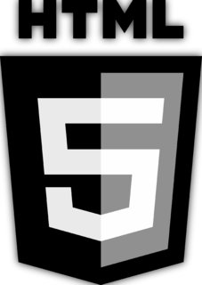
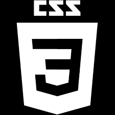

## Milestone 1 [*Acoustra*](https://www.youtube.com/results?search_query=acoustra "Acoustra on YouTube") Band Webpage

### User Experience (UX)

#### User stories

**First Time Visitor Goals**

As a First Time Visitor, I want to easily understand the main purpose of the site and learn more about the band.

As a First Time Visitor, I want to be able to easily navigate throughout the site to find information on the type of band they are.

As a First Time Visitor, I want to look for testimonials to understand what the previous couples think of them and are they a good wedding band. I also want to locate their social media links to see their followings to determine how reliable and known they are.

**Returning Visitor Goals**

As a Returning Visitor, I want to find information about the band.

As a Returning Visitor, I want to find the best way to get in contact with the band with any queries I may have.

As a Returning Visitor, I want to see is there anymore information I may find out about the band.

**Frequent User Goals**

As a Frequent User, I want to check to see if there are any newly added songs to their setlist.

As a Frequent User, I want to check to see if there are any new original songs they are releasing and where to find them.

As a Frequent User, I want to check for any major updates and/or changes to the upcoming gigs so I can attend.

This webpage is designed to be effective and efficient in providing the user with a simple and easy way to find information on the band.
The site will provide a very quick and easy interface to contact and communicate with the band.
All the information they need from a history of the band to videos and audio files along with links to social media will all appear on the first page and grab their attention immediately.

**The Client**

[*Acoustra*](https://www.youtube.com/results?search_query=acoustra "Acoustra on YouTube") are a hard working wedding band. Their goal is to show the user what they are capable of music wise and what they can offer a wedding couple on their special night.
The band are incredibly friendly and very approachable and easy to talk to. They have been renowned for their personal involvement with couples helping them with every aspect of their wedding day even down to having special arrangements with the management of the venue hosting the wedding. They provide a full service form Ceremony to Reception to Live band and then DJ. They even have been known to stay overnight and have a sing song into the wee hours of the morning.

___
## Design

**Colour Scheme**

The three main colours used are rgb(201, 191, 137), this is an off yellow colour that the band use in their Logo. The second colour is rgb(95, 72, 8), this is a darker yellow almost brown colour to emphasize the social media links and the nav menu choices. The third colour is black, again the band use this colour along with yellow as their theme for flyers and business cards.

**Typography**

The Roboto font is the main font used throughout the whole website with Sans Serif as the fallback font in case for any reason the font isn't being imported into the site correctly. Roboto is used here because again it is the main font that the band use on their flyers and business cards.

**Imagery**

Imagery is important. The large, main image is to show the user exactly who the members are so they know who is going to show up n the night of their wedding.

**Wireframes**

Please click the following link to view the wireframes for the project:--------->[Milestone Wireframes](https://github.com/DylanThomasShine/Milestone-1-Acoustra-Band-project/blob/master/assets/wireframes/Acoustra%20Band%20Wireframes.pdf "Dylan's Wireframes")

**Features**

Responsive on all device sizes

Interactive elements such as the Contact Form and social media links

## _Technologies & Languages Used_

    

### **Frameworks, Libraries & Programs Used**

[_**Bootstrap 5.0:**_](https://getbootstrap.com/docs/5.0/getting-started/introduction/ "Bootstrap")

Bootstrap was used to assist with certain aspects for the responsiveness and styling of the website.

[_**Coding Nepal:**_](https://www.codingnepalweb.com/ "Coding Nepal")

CodingNepal was used to help with the NavBar design for mobile view

[_**W3chools:**_](https://www.w3schools.com/cssref/sel_hover.asp "W3Schools")

Hover.css was used on the Social Media icons in the footer to add the float transition while being hovered over.

[**_Google Fonts:_**](https://fonts.google.com/ "Google Fonts")

Google fonts were used to import the **"Roboto"** font into the style.css file which is used on all pages throughout the project.

[**_Font Awesome:_**](https://fontawesome.com/ "Font Awesome")

Font Awesome was used on all pages throughout the website to add icons for aesthetic and UX purposes.

[_**Gitpod:**_](https://gitpod.io/workspaces/ "GitPod")

Git was used for version control by utilizing the Gitpod terminal to commit to Git and Push to GitHub.

[_**GitHub:**_](https://github.com/join/get-started "GitHub")

GitHub is used to store the projects code after being pushed from Git.

[_**Balsamiq Wireframes:**_](https://balsamiq.com/wireframes/?gclid=Cj0KCQjwi7yCBhDJARIsAMWFScNFj3Sxf-xCtB0PDStMlXWuD2krp9YS6AoJWD0fBYEqdoBmvKeXfc0aAlYpEALw_wcB "Balsamiq")

Balsamiq was used to create the wireframes during the design process.

## _Testing_

The W3C Markup Validator and W3C CSS Validator Services were used to validate every page of the project to ensure there were no syntax errors in the project.

 HTML Results

 CSS Results

___

## _Testing User Stories from User Experience (UX) Section_

**First Time Visitor Goals**

As a First Time Visitor, I want to understand the main purpose of the site and learn more about the band.

Upon entering the site, users are automatically greeted with a clean and easily readable navigation bar to go to the page of their choice. The Navigation bar has the band's logo in it's content. Underneath there is an image of the band performing in their wedding attire.

The user has two options, click the HOME, WHAT WE DO or CONTACT action buttons or scroll down, both of which will lead to the same place, to learn more about [*Acoustra*](https://www.youtube.com/results?search_query=acoustra "Acoustra on YouTube").

As a First Time Visitor, I want to be able to easily navigate throughout the site to find content.

The site has been designed to be user friendly. At the top of the page there is a clean navigation bar, each link describes what the page they will end up at clearly.
The Navbar stays in position as the user scrolls or clicks one of the "action" options.
All content has been kept on one page to provide easy scrolling and access to each content. Since it was only three different pages of information it was a lot easier to keep them together and provide links to each part of the band's content.

At the bottom of the page there are clear links and icons to [*Acoustra's*](https://www.youtube.com/results?search_query=acoustra "Acoustra on YouTube") social media content.
On the Contact Us Page, after a form response is filled it will send information to the band's email. If all forms are not filled out correctly a warning will appear to fill in what you have forgotten to do so.

As a First Time Visitor, I want to look for testimonials to understand what the couples who hired [*Acoustra*](https://www.youtube.com/results?search_query=acoustra  "Acoustra on YouTube") thought of them and see if they are a reliable good lively band. I also want to locate their social media links to see their following on social media to determine how well known they are.

Once the new visitor has read the About Us and Band Promise text, they will notice the What we do section.
The user can also scroll to the bottom of the page on the site to locate social media links in the footer.
At the bottom of the Contact Us page, the user is shown a badge to link them to [WBA](https://weddingbandassociation.ie/ "Wedding Band Association"), a site that [_Acoustra_](https://www.youtube.com/results?search_query=acoustra "Acoustra on YouTube") are a member of. This provides opportunities for several other bands to chose from for the user should they not be able to book the band. It also provides security for how reliable [*Acoustra*](https://www.youtube.com/results?search_query=acoustra "Acoustra on YouTube") are.

As a Returning Visitor, I want to find the new gigs the band are playing and any new songs they may have added to their repetoire.

As a Returning Visitor, I want to find the best way to get in contact with the organisation with any questions I may have.

The navigation bar clearly highlights the "Contact Us" Page.
Here they can fill out the form on the page.
The footer contains links to the Acoustra's [Facebook](https://www.facebook.com/Acoustra/ "Acoustra on Facebook"), [Twitter](https://twitter.com/acoustra?lang=en "Acoustra on Twitter"), [Instagram](https://www.picuki.com/tag/Acoustra "ACoustra Instagram Posts") and [Spotify](https://open.spotify.com/artist/1IcCTGmLR5P0IZUBXE4FvD "Acoustra Original Music") pages as well as the band's email.
Whichever link they click, it will be open up in a new tab to ensure the user can easily get back to the website.
The email button is set up to automatically open up your email app and autofill there email address in the "To" section.

As a Returning Visitor, I want to find the social media links to be able to keep up with the band's ongoing updates.

### **Frequent User Goals**

As a Frequent User, I want to check to see if there are any newly added gigs or new song releases.

The user would already be comfortable with the website layout and can easily click social links.

As a Frequent User, I want to check to see if there are any new content information.

The user would already be comfortable with the website layout and can easily click to the section they are looking for.

As a Frequent User, I want to check in at anytime as to the whereabouts of the band incase they are in my area performing.

At the bottom of the page their is a footer which content is easily acceessable.

### **Further Testing**

The Website was tested on Google Chrome in the development tools.
The website was viewed on a variety of devices such as Desktop and mobile view
A large amount of testing was done to ensure that all pages were linking correctly.
I got my wife and son to review the site and documentation to point out any bugs and/or user experience issues.

### **Known Bugs**
All tests have returned with zero problems. Any and all bugs were dealt with and committed accordingly.

___

## _Deployment_

**GitHub Pages**

The project was deployed to GitHub Pages using the following steps...

* I added the new changes I made in the design and development
* I committed all changes and commented on what exactly i did in that session
* I finally pushed all ammendments to Github

## _Credits_

**Code**

The full-screen image was used by the band [Acoustra's](https://www.youtube.com/results?search_query=acoustra "Acoustra on YouTube") permission. It was an image they already had that they let me use.

[Bootstrap5:](https://getbootstrap.com/docs/5.0/getting-started/introduction/ "Bootstrap") Bootstrap Library used in certain aspects of the project mainly to create the Contact Form.

**Content**

I am a member of the band myself and I created the logo's and took the photographs used on the site that I had created before.
All content was written by the developer and [*Acoustra*](https://www.youtube.com/results?search_query=acoustra "Acoustra on YouTube").

[_**Coding Nepal:**_](https://www.codingnepalweb.com/ "Coding Nepal") coding was used in the development of the NavBar. 

**Media**

All Images were created by [*Acoustra*](https://www.youtube.com/results?search_query=acoustra "Acoustra on YouTube").

All logo's were created by [*Acoustra*](https://www.youtube.com/results?search_query=acoustra "Acoustra on YouTube").

**Acknowledgements**

My _Mentor Oluwafemi Medale_ for continuous helpful feedback.

Tutor support at Code Institute for their support.

_Cormac_ci_ code institude tutor and Classroom Co-ordinator for his help and extremely vital support.

_Neil Kavanagh_ci_ institute tutor and Classroom Co-ordinator again for his incredible input along the journey of my project.

[Slack](https://slack.com/intl/en-ie/ "Slack Community") community for help and advise along the way
